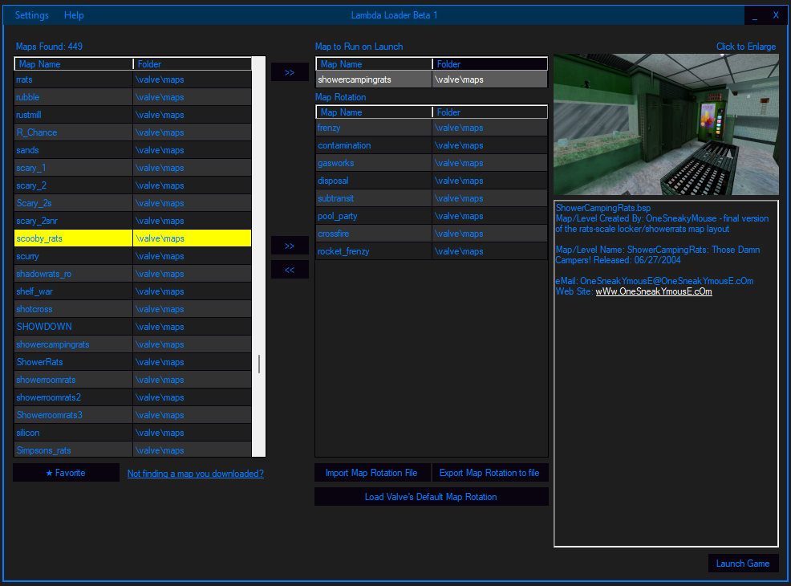

# Lambda Launcher
Lambda Launcher is a tool initially created to be an easier and more visual way of creating mapcycle.txt files for Half-Life. I then added in features for adjusting server settings and launching the game from my program to host a listenserver. A server where a player hosts and plays from the same game instance. This program is not finished and does have some issues outside of using just for creating map cycles.

# Features
* Displays map pictures and map description if corresponding files exist. More info given below.
* Favorite maps to find them easier.
* Create what I call a Map Rotation for seamless action in your favorite maps, never back out of the server or have to memorize map names again.
* Configure server settings through simplified UI menus that offer a basic overview or an advanced page that gives full control to the user.
* Import feature for adding the .jpg previews quickly. I have a pack of .jpg previews, but if you want to add your own just place a .jpg with the same name as your map alongside the map.
* Theme options and implemented in a way users can easily create their own themes.

# How To Use

How it works
* The program scans your map folders and displays which maps it finds.
* If there is a .txt with the same name as a map it is loaded in as the map description.
* If there is a .jpg with the same name as a map it is loaded in as the map preview image. 
* Listenserver: Saves the settings to .cfg files for the game to load. When the program is closed these .cfg files are deleted and the pre existing ones are restored.
* Themes: The program scans for XML files in the \data\Themes folder. Duplicate an .xml file, rename it, and modify the color values to what you want!
* Game Profile Selector. Partially implemented. Works by creating a .llgp file in \data\ and then creating a folder in \data\ with the same name and setting files should be placed inside.

# Other

Bugs
* When connecting to a server launched by Lambda Launcher the maps could be saved to /valve_downloads/overviews instead of /valve_downloads/maps. The reason why is not known and I have not found documentation on why.

To Do:
* Fix bugs.
* Finish the Game Profile selector to make it easier on users who have multiple servers they launch. Documentation for my plans on this are in devs_README.
